<p align="center">
  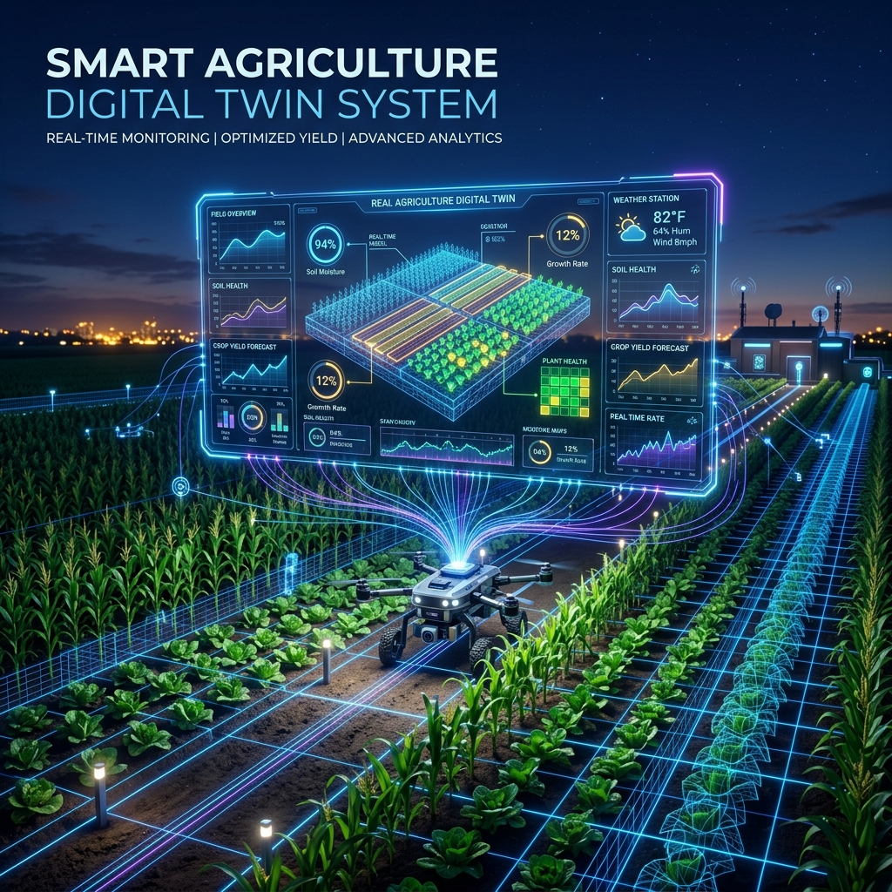
</p>

<p align="center">
  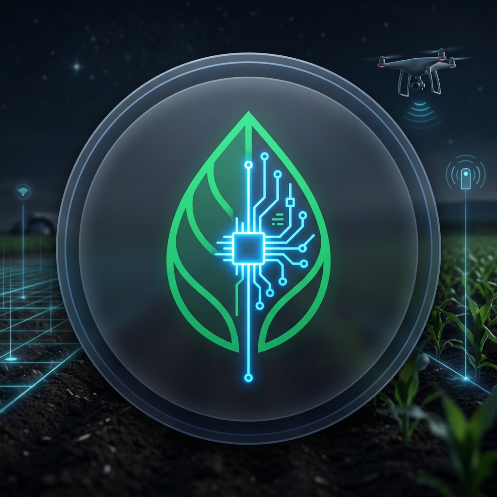
</p>

<h1 align="center">🌾 Smart Agriculture Digital Twin System</h1>

<p align="center">
  <strong>An Enterprise-Grade, Full-Stack, Real-Time Digital Twin Platform for Precision Agriculture</strong>
</p>

<p align="center">
  <a href="https://smart-agriculture-digital-twin-system.onrender.com"><strong>🔗 Live Demo Application</strong></a>
  <span> | </span>
  <a href="https://github.com/mishraanshul870-lab/smart-agriculture-digital-twin-system"><strong>💻 GitHub Repository</strong></a>
</p>

<p align="center">
  <a href="https://github.com/mishraanshul870-lab/smart-agriculture-digital-twin-system"></a>
  <a href="https://github.com/mishraanshul870-lab/smart-agriculture-digital-twin-system"></a>
  <a href="https://github.com/mishraanshul870-lab/smart-agriculture-digital-twin-system/issues"></a>
  <a href="https://github.com/mishraanshul870-lab/smart-agriculture-digital-twin-system/commits/main"></a>
  
  
</p>

<p align="center">
  
  
  
  
  
  
  
  
</p>

---

## 🗺️ Table of Contents

- [📖 Project Overview](#-project-overview)
- [✨ Implemented Core Features](#-implemented-core-features)
- [🛠️ Technology Stack](#️-technology-stack)
- [📊 System Architecture](#-system-architecture)
- [📂 Project Directory Structure](#-project-directory-structure)
- [⚙️ Installation & Configuration](#️-installation--configuration)
- [🖥️ Application Gallery](#️-application-gallery)
- [☁️ Deployment Reference](#️-deployment-reference)
- [🔮 Future Enhancements](#-future-enhancements)
- [📄 License](#-license)
- [👤 Author](#-author)

---

## 📖 Project Overview

**Smart Agriculture Digital Twin System** is an enterprise-grade full-stack simulation, tracking, and prediction platform. By combining **Real-time IoT Telemetry Streams**, **Soil/Crop Lifecycle Analytics**, **AI-Powered Diagnostics**, and **Google Gemini Generative AI**, it creates a virtual "Digital Twin" copy of any farm, field, and crop. 

Farmers and agronomists can track microclimatic conditions, diagnose diseases visually, evaluate harvest predictions, formulate precise fertilization strategies, and generate structured telemetry dossiers to optimize operational efficiency and maximize crop yields.

### 🌐 Key System Highlights

- **Bilingual Interface**: High-fidelity, real-time localized toggle supporting complete English and Hindi (`हिन्दी`) rendering.
- **Dynamic Diagnostics**: Seamless plant leaf scan analysis using Gemini Vision API extraction.
- **Integrated Telemetry**: Background simulator loop providing periodic readings for temperature, humidity, and soil moisture sensors.
- **Interactive Recharts**: Multi-parameter timelines visualizing telemetry trends, crop health, and scenario analytics.

---

## ✨ Implemented Core Features

Our platform is structured into modular feature sets representing high-performance agronomic operations:

<details open>
<summary><strong>📐 1. Digital Twin & Farm Management</strong></summary>

- **Command Center Dashboard**: Visualizes overall farm performance score, crop vitals, active alerts, and weather status panels.
- **Field Configurations**: Map-based boundary setups, coordinate plots, crop variety grids, and planted area management.
- **Visual Twin Widgets**: Status indicators linking soil analysis matrices with active fields.
</details>

<details>
<summary><strong>🧪 2. Soil Analysis & IoT Telemetry</strong></summary>

- **Active Soil Vitals**: Interactive N-P-K nutrient bar chart indicators, pH scale dials, and organic carbon calculations.
- **IoT Sensors Dashboard**: Multi-sensor charting reflecting soil moisture logs, ambient temperature scales, and humidity ratios.
- **Real-Time Telemetry Loop**: Automated backend process generating realistic physical readings every 5 minutes.
</details>

<details>
<summary><strong>🍃 3. Crop Disease Diagnostics & AI Assistance</strong></summary>

- **Leaf Diagnostic Scan**: Real-time Plant Pathology feature allowing image uploads to identify fungal, bacterial, or viral pathogens via Gemini Vision.
- **AI Agronomist Chat**: Integrated assistant providing suggestions (Irrigation, Crop Rotation, Pests, Weeding) and answering complex agronomic queries.
- **Bilingual Responses**: AI insights, summaries, analysis, and prevention plans translate on-the-fly depending on active locale.
</details>

<details>
<summary><strong>📈 4. Yield Prediction & Scenario Analysis</strong></summary>

- **Crop Yield Simulator**: Computes projected crop yields based on soil composition, irrigation types, fertilizer applications, and seasonal climate models.
- **Recharts Scenarios**: Renders projections showing Best Case, Expected Case, and Worst Case harvests.
</details>

<details>
<summary><strong>📑 5. Report Dossiers & Notification Center</strong></summary>

- **Structured PDF Reports**: Downloads comprehensive multi-page field dossiers containing system parameters, QR-verified hashes, and telemetry data tables.
- **Timeline Groups**: Chronological listing of alerts, security notices, and market prices, grouped dynamically by date ("Today" / "Yesterday").
- **Auth Guard**: Secure JWT user sessions protecting database routes.
</details>

---

## 🛠️ Technology Stack

| Layer | Technologies | Description |
|---|---|---|
| **Frontend Core** | React 19, TypeScript, Tailwind CSS | High-performance user interface, strict type checking, and modular styling. |
| **Animation & Charts** | Framer Motion, Recharts, Lucide React | Liquid animations, interactive sensor charts, and responsive SVG iconography. |
| **Backend Core** | Node.js, Express.js | Robust, event-driven REST API server. |
| **Database** | MongoDB Atlas, Mongoose | Cloud-managed document storage and schema integrity constraints. |
| **AI Integration** | Google Gemini SDK, Gemini Vision | Generative AI models for diagnostic pathology, translation services, and chat advisories. |
| **PDF Processing** | jsPDF, jsPDF-AutoTable | Client-side generation of high-resolution PDF reports. |
| **Hosting** | Render Cloud Platform | Scalable containerized cloud deployments. |

---

## 📊 System Architecture

The following diagram represents the end-to-end data flow, illustrating how client entry points interact with the backend API, MongoDB Atlas, and AI services:

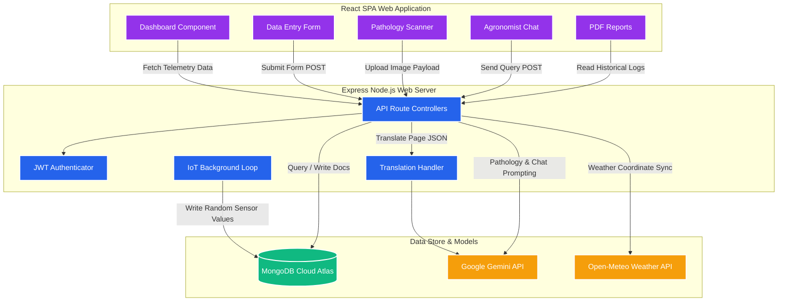

---

## 📂 Project Directory Structure

```text
smart-agriculture-digital-twin/
├── assets/                          # Static Documentation Assets
│   ├── banner/                      # Branding and Cover Images
│   │   ├── banner.png               # Hero Banner Graphic
│   │   └── logo.png                 # Circular Vector Logo
│   └── screenshots/                 # Application Screenshot Gallery
│       ├── login.png                # 1. Login Page
│       ├── dashboard.png            # 2. Main Dashboard
│       ├── yield-prediction.png     # 3. Crop Yield Simulator
│       ├── notifications.png        # 4. Notification Center
│       ├── reports.png              # 5. Reports Dossier
│       ├── ai-assistant.png         # 6. AI Agronomist Assistant
│       ├── farm-layout.png          # 7. Field Configurations
│       ├── add-record.png           # 8. Add Record Entry Forms
│       └── profile.png              # 9. Profile Management
├── server/                          # REST API Express Server
│   ├── aiService.ts                 # AI Model Integrations & Pathology
│   ├── db.ts                        # Mongoose Connection & Seed Schemes
│   ├── routes.ts                    # Server API Route Controller Endpoints
│   └── telemetrySimulator.ts        # Background Telemetry Sensor Loops
├── src/                             # React Client Source Code
│   ├── components/                  # Client View Component Modules
│   │   ├── AssistantChat.tsx        # AI Assistant Interface
│   │   ├── Dashboard.tsx            # Main Command Center
│   │   ├── DataEntry.tsx            # Add Records Form Views
│   │   ├── DiseaseDetection.tsx     # Pathology Leaf Diagnostics Scanner
│   │   ├── IoTDashboard.tsx         # IoT Telemetry Trend Graphics
│   │   ├── NotificationCenter.tsx   # Grouped Activities & Alerts Log
│   │   ├── Profile.tsx              # Account Profile Settings Form
│   │   ├── Reports.tsx              # Reports History Table & PDF Download
│   │   └── YieldCalculator.tsx      # Yield Projection Gauge & Scenarios
│   ├── utils/
│   │   └── i18n.ts                  # Central English & Hindi Translations
│   ├── App.tsx                      # Component Router & Base Layout
│   ├── index.css                    # Tailwind Directives & Core CSS System
│   └── main.tsx                     # DOM Client Entry Point
├── package.json                     # System Scripts & Version Dependencies
├── tsconfig.json                    # Compiler Target Rules for TypeScript
├── vite.config.ts                   # Frontend Builder Config Directives
└── README.md                        # Project General Documentation
```

---

## ⚙️ Installation & Configuration

Follow these steps to run the Smart Agriculture Digital Twin System on your local development machine:

### 📋 Prerequisites
- **Node.js**: Version 22.x or later installed.
- **npm**: Version 10.x or later.
- **MongoDB**: Access to a MongoDB Atlas cluster or a running local instance. (If omitted, the server automatically boots an **In-memory MongoDB Server**).

### 🚀 Step 1: Clone the Repository
```bash
git clone https://github.com/mishraanshul870-lab/smart-agriculture-digital-twin-system.git
cd smart-agriculture-digital-twin-system
```

### 📦 Step 2: Install System Dependencies
Install both client and server package dependencies defined in `package.json`:
```bash
npm install
```

### 📝 Step 3: Configure Environment Variables
Create a `.env` file in the root directory. Copy variables from `.env.example` and set your specific keys:
```bash
cp .env.example .env
```
Open the `.env` file and populate the properties:
```properties
# GEMINI_API_KEY: Required for Gemini AI diagnostics. Open Google AI Studio to obtain.
GEMINI_API_KEY="your_actual_gemini_api_key"

# OPENAI_API_KEY: Required only if AI_PROVIDER is set to 'openai'
OPENAI_API_KEY="your_openai_api_key_if_used"

# AI_PROVIDER: Select active model engine ('gemini' | 'openai' | 'mock')
AI_PROVIDER="gemini"

# MONGODB_URI: Database URI connection string (Leave blank to use In-Memory MongoDB fallback)
MONGODB_URI="mongodb+srv://<username>:<password>@cluster.mongodb.net/agri-twin"

# APP_URL: Host address configurations
APP_URL="http://localhost:3000"
```

### 🧪 Step 4: Run the Application (Development Mode)
Start the frontend Vite compiler and backend Express server concurrently:
```bash
npm run dev
```
Upon successful boot, the system will output:
- **Client App URL**: `http://localhost:3000`
- **Database Status**: Conformed database seeding and sensor loops startup messages.

### 📦 Step 5: Compile Production Bundles
To check production readiness and bundle scripts, run the compilation script:
```bash
npm run build
```
This output bundle is generated inside the `dist` directory.

---

## 🖥️ Application Gallery

Here is a visual walk-through of the Smart Agriculture Digital Twin System, showing all localized modules in their target responsive designs:

<br />

<div align="center">
  <h3>🔒 1. Access Gateway</h3>
  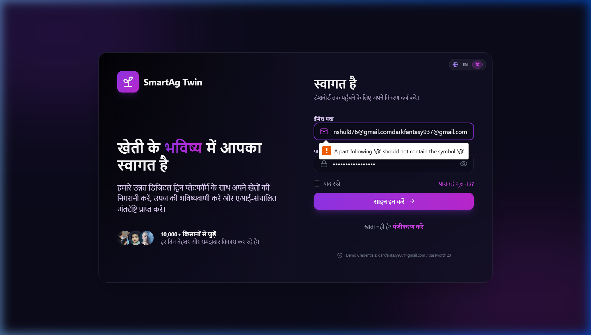
  <p><em>Secure JWT Authentication login view protecting personal farmer configurations. Sign in using user credentials.</em></p>
</div>

<br />

<div align="center">
  <h3>📊 2. Farm Command Center</h3>
  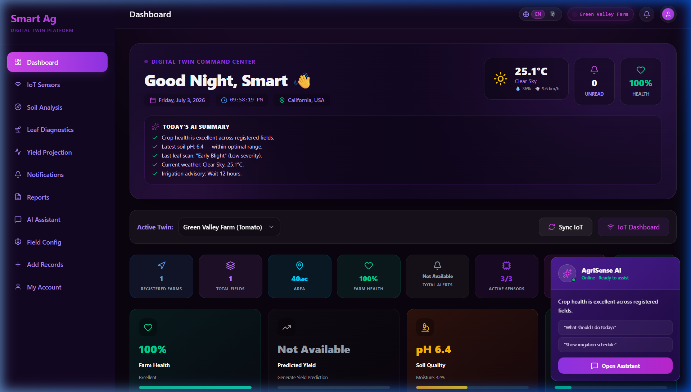
  <p><em>Main dashboard view displaying overall performance cards, live microclimatic telemetry, active warnings, and Gemini insights.</em></p>
</div>

<br />

<div align="center">
  <h3>🌾 3. AI Crop Yield Simulator</h3>
  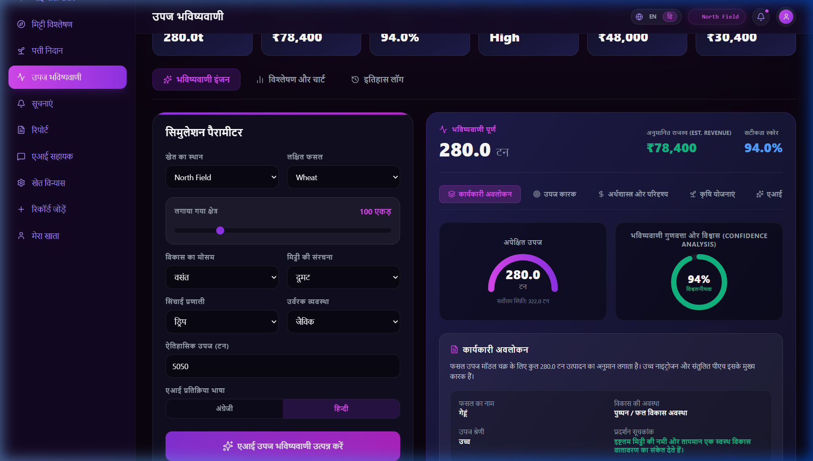
  <p><em>Precision yield simulator modeling crops based on area, season, soil, and fertilizers, alongside multi-scenario graphs.</em></p>
</div>

<br />

<div align="center">
  <h3>🔔 4. Notifications Center</h3>
  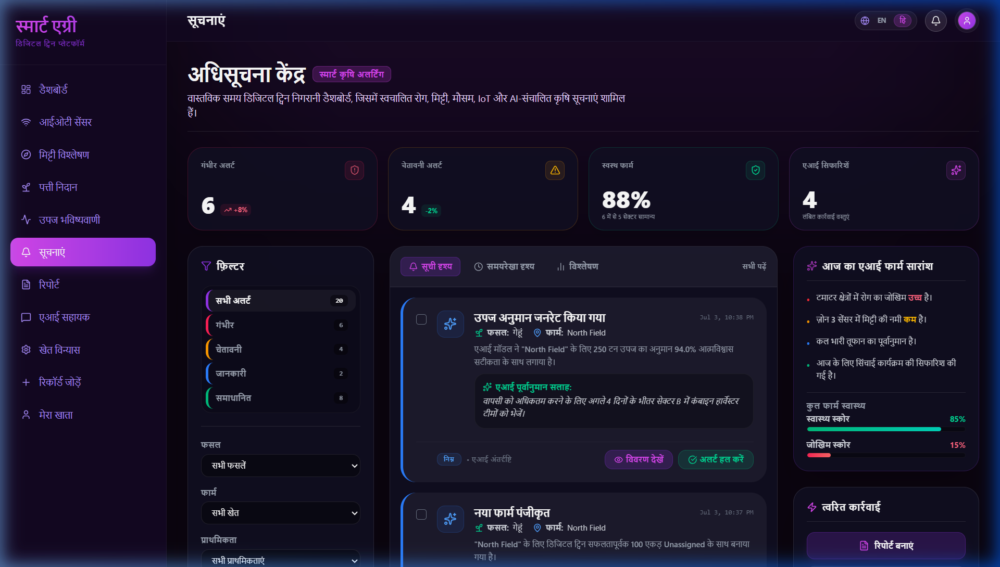
  <p><em>Chronological timeline log displaying system alerts and recommendations grouped dynamically under bilingual date banners.</em></p>
</div>

<br />

<div align="center">
  <h3>📑 5. Report Dossier Archives</h3>
  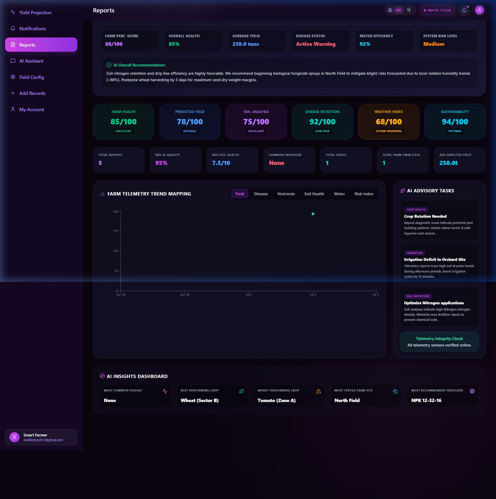
  <p><em>Dossiers list showcasing historical soil analyses and disease diagnoses, complete with instant PDF compilation download triggers.</em></p>
</div>

<br />

<div align="center">
  <h3>🤖 6. AI Agronomist Assistant</h3>
  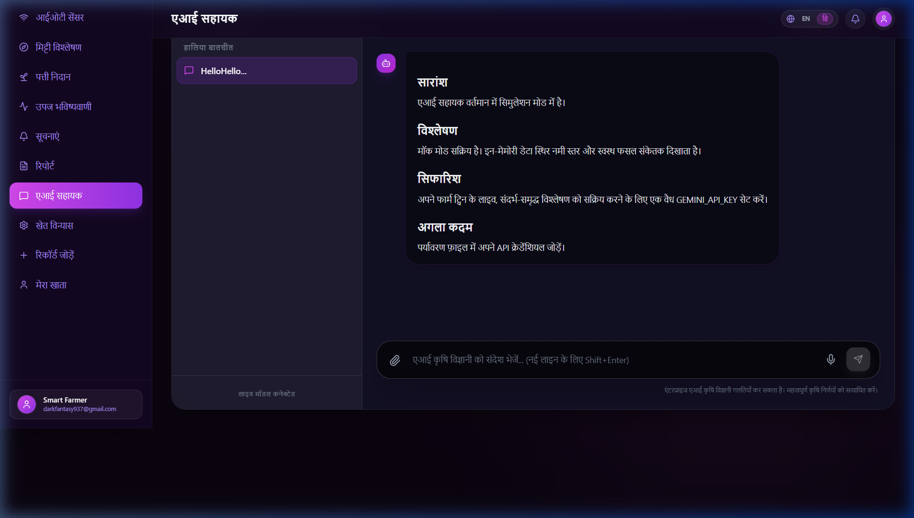
  <p><em>Conversational AI interface suggesting farming routines and answering questions, with fully localized Hindi replies.</em></p>
</div>

<br />

<div align="center">
  <h3>🚜 7. Field Configurations</h3>
  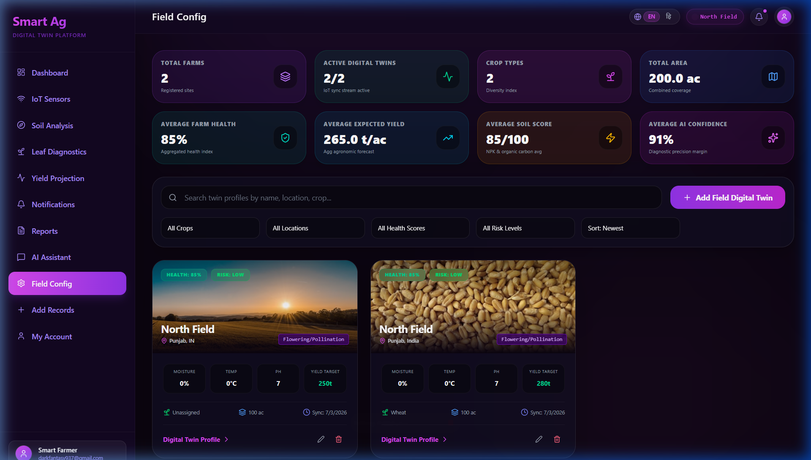
  <p><em>Digital Twin farm builder displaying boundary acres, crop types, sensor maps, and coordinate points.</em></p>
</div>

<br />

<div align="center">
  <h3>📝 8. Sensor Log Entry Form</h3>
  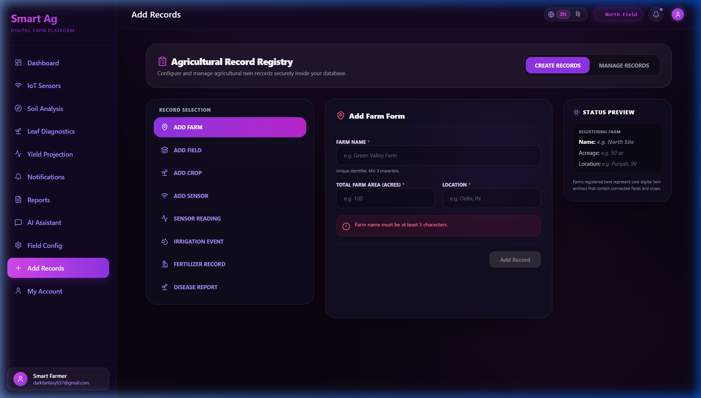
  <p><em>Bilingual telemetry input cards allowing manual recording of soil, water, and crop variables.</em></p>
</div>

<br />

<div align="center">
  <h3>👤 9. Profile Settings Management</h3>
  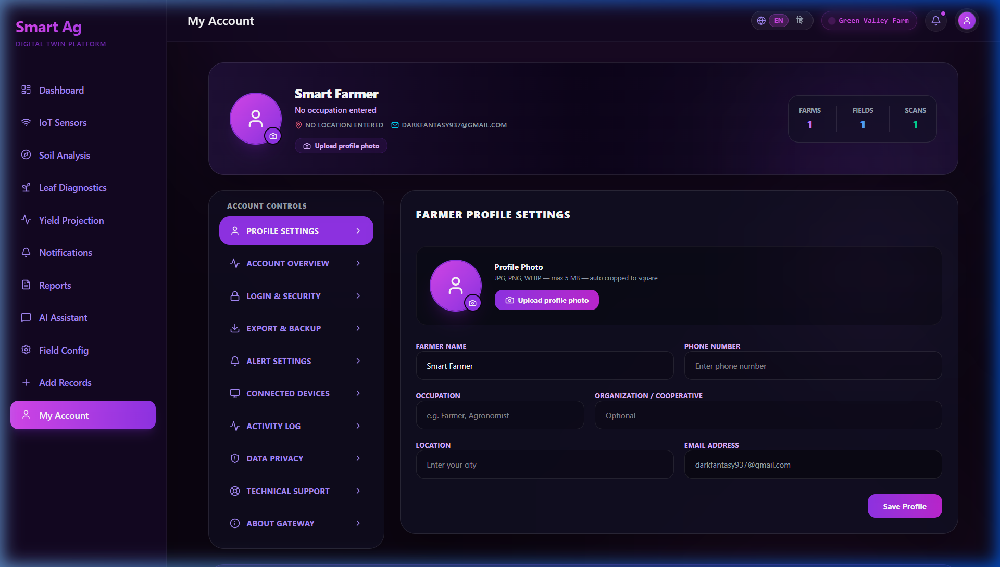
  <p><em>Personal settings panel enabling farmers to update coordinates, upload profile avatars, and select interface locales.</em></p>
</div>

---

## ☁️ Deployment Reference

### 1. MongoDB Atlas Setup
1. Create a free shared cluster on MongoDB Atlas.
2. Under Database Access, create a user with read/write privileges.
3. Under Network Access, whitelist the IP addresses or set access to `0.0.0.0/0` for production hosting environments.
4. Copy the SRV connection string and set it as `MONGODB_URI` in your host environment secrets.

### 2. Render Deployment Configurations
This repository is configured for effortless deployment on Render:
1. Connect your GitHub repository to Render.
2. Select **Web Service** as the service type.
3. Set the following build and startup parameters:
   - **Runtime**: `Node`
   - **Build Command**: `npm run build`
   - **Start Command**: `npm start`
4. Under Environment variables, configure the required keys (`GEMINI_API_KEY`, `MONGODB_URI`, `AI_PROVIDER=gemini`).

---

## 🔮 Future Enhancements
- **Spatial Map Grid Layers**: Integrate interactive leaflet layers showing crop health maps.
- **Physical IoT Nodes Integration**: Provide connection scripts for ESP32/Arduino physical microcontrollers.
- **Automatic Multi-Language Swapping**: Incorporate auto-detection locales matching browser header values.

---

## 📄 License
This project is licensed under the MIT License - see the [LICENSE](LICENSE) file for details.

---

## 👤 Author
- **Anshul Mishra** - *Lead Systems Architect & Full-Stack AI Engineer* - [GitHub](https://github.com/mishraanshul870-lab)

---

## 🤝 Contributing
Contributions are welcome! Please feel free to open issues or submit pull requests for feature additions or translation expansions.

---

## 📞 Support
For support, technical queries, or feedback, please reach out via GitHub Issues or contact the author directly at [mishraanshul870@gmail.com](mailto:mishraanshul870@gmail.com).

---

## 💖 Acknowledgements
- **Google DeepMind** for providing the advanced Gemini API and Gemini Vision model engines.
- **Vite.js** and the React community for providing state-of-the-art building tools.
- All Open Source authors of leaf diagnostic databases.
